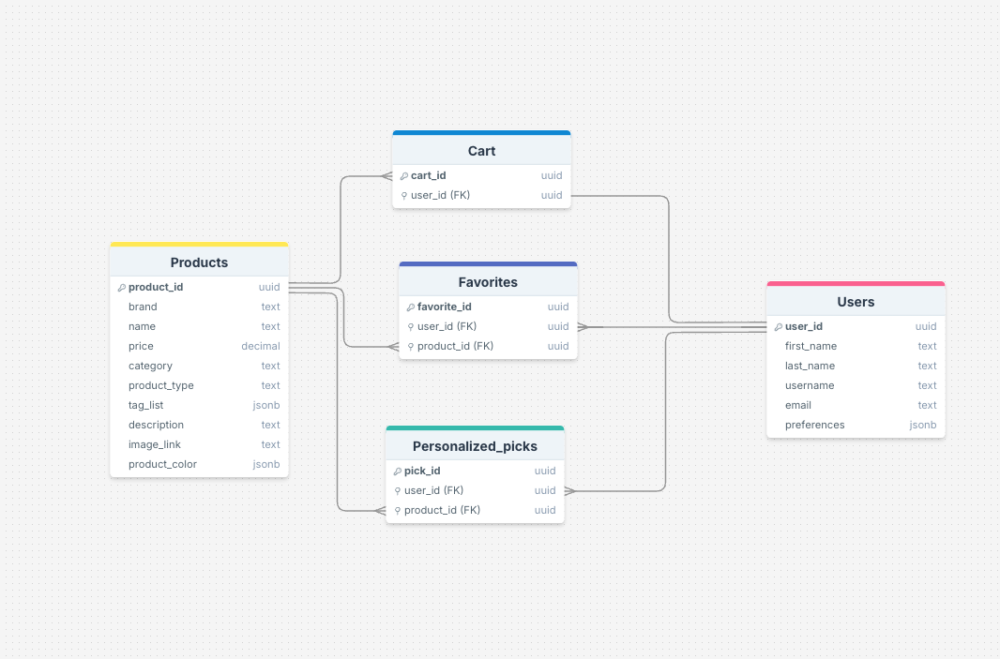

# Nyxis Makeup Shop
### Author: Daria Zelenska
### Springboard Software Engineering Career Track
### Capstone 2: Project Proposal

# Nyxis Project Proposal

|            | Description                                                                                                                                                                                                                                                                                                                                              | Fill in                                                                                                                                                                                                                                                                                                                                                                                                                                   |
|------------|----------------------------------------------------------------------------------------------------------------------------------------------------------------------------------------------------------------------------------------------------------------------------------------------------------------------------------------------------------|-------------------------------------------------------------------------------------------------------------------------------------------------------------------------------------------------------------------------------------------------------------------------------------------------------------------------------------------------------------------------------------------------------------------------------------------|
| **Tech Stack** | What tech stack will you use for your final project?                               | React.js for frontend, JSON-Server for backend (local development), PostgreSQL for keeping users data, Bootstrap for styling, JavaScript (Node.js, Express.js) for functionality, Makeup API for product data.                                                                                                                                                                                                                            |
| **Type**       | Will this be a website? A mobile app? Something else?                                                                                                                                                                                                                                                                                                    | Website                                                                                                                                                                                                                                                                                                                                                                                                                                   |
| **Goal**       | What goal will your project be designed to achieve?                                                                                                                                                                                                                                                                                                      | Build a user-friendly and personalized makeup shopping platform called "Nyxis." Users will be able to explore makeup products, create accounts, save their favorite products, use a shopping cart, and view personalized product suggestions through a feature called "Picks for You," which is based on their preferences.                                                                                                               |
| **Users**      | What kind of users will visit your app? In other words, what is the demographic of your users?                                                                                                                                                                                                                                                           | Primarily individuals interested in beauty and makeup products. Users who are looking for an easy and personalized shopping experience and want to explore and buy beauty products based on their own preferences.                                                                                                                                                                                                                        |
| **Data**       | What data do you plan on using? How are you planning on collecting your data? You may have not picked your actual API yet, which is fine, just outline what kind of data you would like it to contain. You are welcome to create your own API and populate it with data. If you are using a Python/Flask stack, you are required to create your own API. | I will use the Makeup API (http://makeup-api.herokuapp.com/) to gather product data including product names, brands, types, tags, and prices. User data will be collected upon registration, and preferences for makeup products will be stored in the user profile for the "Picks for You" feature. Additionally, user preferences will help filter recommendations based on their choices, such as foundation shade or favorite brands. |

# Project Breakdown

| Task Name                            | Description                                                                                                                                              | Example                                                 |
|--------------------------------------|----------------------------------------------------------------------------------------------------------------------------------------------------------|---------------------------------------------------------|
| Design Database schema               | Determine the models and database schema required for your project, including users, products, favorites, and cart.                                        | [Schema](resources/makeup_shop_schema.png)              |
| Source Data                          | Determine where your data will come from. In this case, you will use the Makeup API to fetch makeup product data.                                          | [API](http://makeup-api.herokuapp.com/?ref=apilist.fun) |
| User Flows                           | Define how users will navigate through the app, including browsing products, managing favorites, and using the shopping cart.                              | [Flows](resources/shop_flow.pdf )                       |
| Set up backend and database          | Set up JSON-Server for local development and configure the environment for a backend to store user information like favorites and cart data.               | Backend                                                 |
| Set up frontend                      | Set up React.js as the frontend framework and connect it to the Makeup API and your backend with API calls to handle data.                                 | Frontend, Medium, Must Have                             |
| User Authentication                  | Implement user authentication for sign-up and login to allow users to manage their preferences, favorites, and shopping cart.                              | Full-stack feature, Easy, Must Have                     |
| Set up forms                         | Implement sign-up and login forms. Provide product filtering and searching forms by brand, type, category, tags, and price.                                | Frontend, Easy, Must Have                               |
| Set up User model                    | Define the user model to store information about registered users, their preferences, and their favorite products.                                         | Full-Stack, Easy, Must Have                             |
| Set up Product model                 | Define the product model that will contain information about the makeup products fetched from the Makeup API.                                              | Backend, Easy, Must Have                                |
| Set up Favorites model               | Define the favorites model to allow users to save and manage their favorite products.                                                                      | Backend, Easy, Must Have                                |
| Set up Cart model                    | Define the cart model to allow users to add products to their shopping cart and manage the checkout process.                                               | Backend, Easy, Must Have                                |
| User Authentication & Authorization  | Implement the logic for user authentication and authorization to protect user-specific pages like the favorites list and shopping cart.                    | Full-stack feature, Medium, Must Have                   |
| Add Favorites Feature                | Full-stack feature that allows users to add products to their favorites and view them on their personal favorites page.                                    | Full-stack feature, Medium, Must Have                   |
| Add Shopping Cart                    | Full-stack feature enabling users to add products to the cart and manage the checkout process.                                                             | Full-stack feature, Medium, Must Have                   |
| Add Search Functionality             | Implement a search functionality that allows users to filter products by brand, type, category, tags, and price.                                           | Full-stack feature, Medium, Must Have                   |
| Add Personalized Picks               | Full-stack feature that shows a “Picks for You” page, where users are shown products based on their preferences collected during registration.             | Full-stack feature, Medium, Nice to Have                |
| Implement Recommendations Logic      | Implement the logic to filter and display personalized product recommendations based on user preferences and behavior.                                      | Full-stack feature, Medium, Nice to Have                |
| Making and editing list of products  | Full-stack feature that allows users to see and filter a list of makeup products and manage favorites.                                                     | Full-stack feature, Medium, Must Have                   |


# Database Schema



# How to Start and Run 

## 1. Prerequisites
Before running the application, ensure you have the following installed on your system:

- Version 16 or higher is recommended.
  [Download Node.js](https://nodejs.org/)
- Git Version control system to clone the repository.
 [Download Git] (https://git-scm.com/)
- npm : Comes bundled with Node.js. If you prefer, you can use Yarn as an alternative package manager.
- A code editor like WebStorm or VS Code.


## 2. Dependencies
The following dependencies are required to run the app. They will be installed automatically when you run npm install:

- React: Framework for building user interfaces.
- React-DOM: Library for DOM rendering in React.
- Reactstrap: Bootstrap components for React.
- Bootstrap: CSS framework for responsive design.
- Font Awesome: Icon toolkit for React (@fortawesome packages).
- Slick Carousel: Slider library for carousels (react-slick and slick-carousel).
- Lodash: Utility library for JavaScript.
- Axios: Library for HTTP requests (assumed based on the code).
- Stripe.js: Library for Stripe payment integration.


## 3.Browser Compatibility
Ensure you use one of the following modern browsers:

- Google Chrome (latest version)
- Mozilla Firefox (latest version)
- Microsoft Edge (latest version)

# Setup Instructions

   ##  1.Clone the Repository
   1. Open your terminal or command prompt.
   2. Clone the repository using the following command:

    git clone https://github.com/ZelenskaD/CapstoneProject2
  
   3. Navigate to the project directory:

    cd CapstoneProject2

   


  ## 2. Install Dependencies 

   Install the required npm packages by running:

    npm install

  ## 3. Environment Variables
   
  1. Create a .env file in the root directory of the project.
  2. Add the necessary environment variables:

    REACT_APP_API_URL=http://localhost:5000/api
    REACT_APP_STRIPE_PUBLIC_KEY=your_stripe_public_key_here


# Running the Application

## Start the Development Server

1. **Start the Frontend Server**  
   Navigate to the `CapstoneProject2/projects/frontend/nyxis` folder :


  ```bash
    cd nyxis
   ```
 
  - Install dependencies:

   ```bash
    npm install
   ```
    

  - Start the frontend server:
   
    ```bash
    npm start
    ```
(This will run Frontend server)


## Start the Development Server

2. **Start the Backend Server**  
   Navigate to the `CapstoneProject2/projects/backend` folder :

   ```bash
    cd backend
   ```

  - Install dependencies:

   ```bash
    npm install
   ```
    
   - Start the backend server:
   
   ```bash
    npm start
   ```

(This will run Backend server)

 3. **Open in Browser**  
   The application will be available at:

       http://localhost:3000


# Project Directory Structure


```
project/
│
├── backend/
│   ├── helpers/
│   │   ├── sql.js
│   │   ├── tokens.js
│   │
│   ├── middleware/
│   │   ├── auth.js
│   │
│   ├── models/
│   │   ├── category.js
│   │   ├── product.js
│   │   ├── tag.js
│   │   ├── user.js
│   │
│   ├── routes/
│   │   ├── auth.js
│   │   ├── cart.js
│   │   ├── categories.js
│   │   ├── products.js
│   │   ├── stripe.js
│   │   ├── tags.js
│   │   ├── users.js
│   │
│   ├── schemas/
│   │   ├── categoryFilter.json
│   │   ├── categoryNew.json
│   │   ├── categorySearch.json
│   │   ├── categoryUpdate.json
│   │   ├── preferencesUpdate.json
│   │   ├── productFilter.json
│   │   ├── productNew.json
│   │   ├── productSearch.json
│   │   ├── productUpdate.json
│   │   ├── tagFilter.json
│   │   ├── tagNew.json
│   │   ├── tagSearch.json
│   │   ├── tagUpdate.json
│   │   ├── userAuth.json
│   │   ├── userNew.json
│   │   ├── userRegister.json
│   │   ├── userUpdate.json
│   │
│   ├── .env
│   ├── .gitignore
│   ├── api.js
│   ├── app.js
│   ├── config.js
│   ├── db.js
│   ├── db.json
│   ├── expressError.js
│   ├── nyxis.sql
│   ├── nyxis-schema.sql
│   ├── nyxis-seed.sql
│   ├── package.json
│   ├── package-lock.json
│   ├── server.js
│   ├── testApi.js
│
├── frontend/
│   ├── nyxis/
│   │   ├── node_modules/
│   │   ├── public/
│   │   ├── src/
│   │   │   ├── Banners/
│   │   │   │   ├── BannerCarousel.js
│   │   │   │
│   │   │   ├── Forms/
│   │   │   │   ├── LoginForm.js
│   │   │   │   ├── SignupForm.js
│   │   │   │
│   │   │   ├── OtherComponents/
│   │   │   │   ├── images/
│   │   │   │   │   ├── BrandImages.js
│   │   │   │   │   ├── default_picture_cart.png
│   │   │   │   │
│   │   │   │   ├── ButtonsComponent.js
│   │   │   │   ├── CancelModal.js
│   │   │   │   ├── CartModal.js
│   │   │   │   ├── Footer.js
│   │   │   │   ├── Homepage.js
│   │   │   │   ├── ModalDropdown.js
│   │   │   │   ├── NavBar.js
│   │   │   │   ├── ParentComponent.js
│   │   │   │   ├── ProblematicLinks.js
│   │   │   │   ├── SuccessModal.js
│   │   │   │   ├── TagsButtonComponent.js
│   │   │   │   ├── UserContext.js
│   │   │   │
│   │   │   ├── ProductsComponents/
│   │   │   │   ├── FilteredProducts.js
│   │   │   │   ├── ProductCard.js
│   │   │   │   ├── ProductDetail.js
│   │   │   │   ├── ProductsList.js
│   │   │   │   ├── Shop.js
│   │   │   │
│   │   │   ├── Styles/
│   │   │   │   ├── BannerCarousel.css
│   │   │   │   ├── BrandImages.css
│   │   │   │   ├── ButtonsComponent.css
│   │   │   │   ├── CartModal.css
│   │   │   │   ├── CategoryLinks.css
│   │   │   │   ├── Footer.css
│   │   │   │   ├── Forms.css
│   │   │   │   ├── ModalDropdown.css
│   │   │   │   ├── NavBar.css
│   │   │   │   ├── NotFound.css
│   │   │   │   ├── ProductCard.css
│   │   │   │   ├── ProductDetail.css
│   │   │   │   ├── ProductList.css
│   │   │   │   ├── SignupForm.css
│   │   │   │   ├── SuccessModal.css
│   │   │   │   ├── TagsButtonComponent.css
│   │   │   │
│   │   │   ├── App.js
│   │   │   ├── App.css
│   │   │   ├── api.js
│   │   │   ├── index.js
│   │   │   ├── reportWebVitals.js
│   │   │   ├── setupTests.js
│   │   │
│   │   ├── package.json
│   │   ├── package-lock.json
│   │   ├── README.md

```


