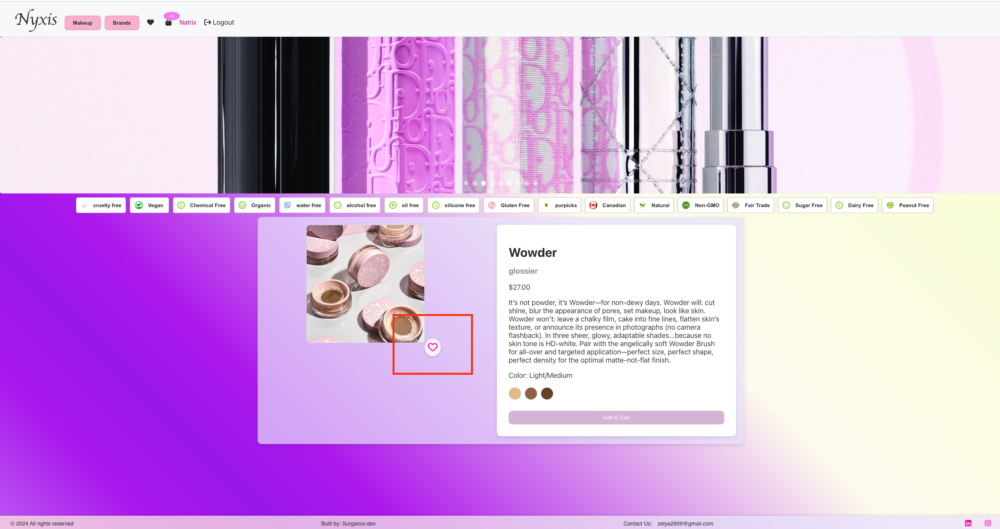

# How to add a product to favorites

1. Choose a product that you want to add to your favorites.

2. Open the product detail page by clicking on the product card.

3. Click on the heart/like icon under the product picture to add it to your favorites.

4. Track your favorites through the navigation bar by clicking the heart symbol.
